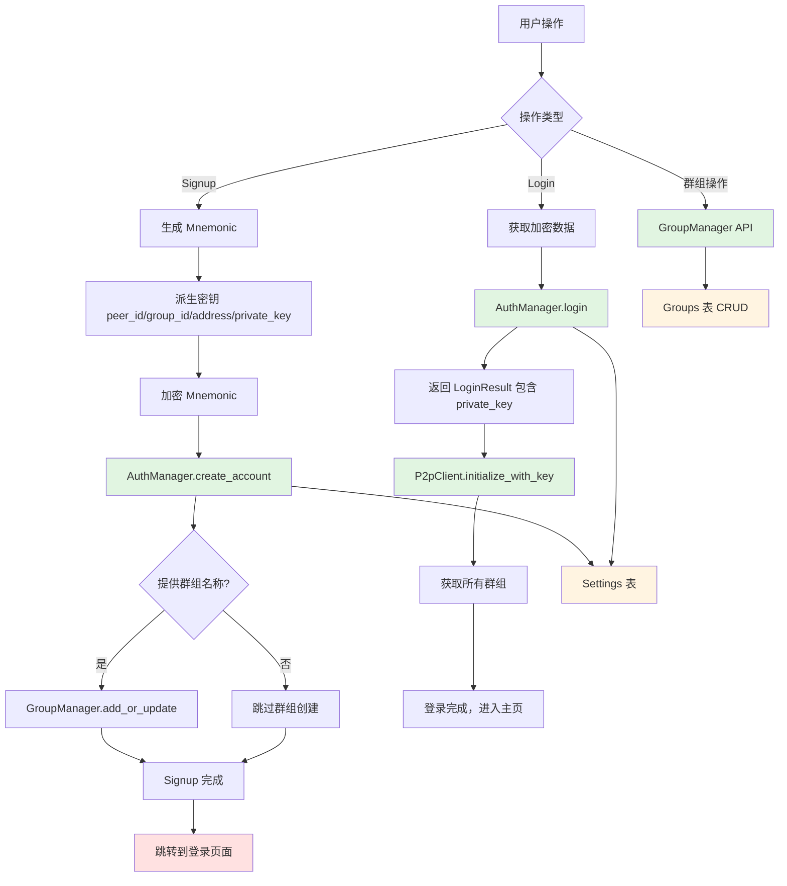

# 最终实现计划

## 📋 项目概述

基于 `NOTES-Signup.md` 文档，使用后端存储重新实现 signup 和 login 流程。后端核心组件已实现，需要创建 Tauri commands 桥接前端。

---

## 🏗️ 架构设计

### 依赖关系图



---

## 📁 文件结构

```
pkgs/tauri-plugin-gigi-p2p/src/
├── commands/
│   ├── auth.rs          # 新增：认证相关命令
│   ├── groups.rs        # 新增：群组相关命令
│   ├── messaging.rs     # 已存在：P2P 消息命令
│   ├── conversations.rs # 已存在：会话相关命令
│   └── mod.rs           # 更新：导出新命令
├── lib.rs               # 更新：注册新命令
└── models.rs            # 更新：添加 AuthManager 和 GroupManager 到 PluginState
```

---

## 🔧 后端实现

### 1️⃣ 更新 `models.rs` - 添加管理器到 PluginState

```rust
// 在 PluginState 中添加
use gigi_auth::AuthManager;
use gigi_store::{GroupManager, SettingsManager};

pub struct PluginState {
    // 已有字段...
    pub auth_manager: Arc<RwLock<Option<AuthManager>>>,
    pub group_manager: Arc<RwLock<Option<GroupManager>>>,
    pub settings_manager: Arc<RwLock<Option<SettingsManager>>>,
}
```

### 2️⃣ 创建 `commands/auth.rs` - 认证命令

#### 命令列表：

```rust
/// 使用助记词、密码、昵称创建账户（可选群组名称）
#[tauri::command]
pub async fn auth_signup(
    app: AppHandle,
    state: State<'_, PluginState>,
    mnemonic: String,
    password: String,
    name: String,
    group_name: Option<String>,
) -> Result<AccountInfo>

/// 使用密码登录
#[tauri::command]
pub async fn auth_login(
    state: State<'_, PluginState>,
    password: String,
) -> Result<LoginResult>

/// 获取账户信息（不包含敏感数据）
#[tauri::command]
pub async fn auth_get_account_info(
    state: State<'_, PluginState>,
) -> Result<Option<AccountInfo>>

/// 检查账户是否存在
#[tauri::command]
pub async fn auth_has_account(
    state: State<'_, PluginState>,
) -> Result<bool>

/// 修改密码
#[tauri::command]
pub async fn auth_change_password(
    state: State<'_, PluginState>,
    old_password: String,
    new_password: String,
) -> Result<()>

/// 删除账户
#[tauri::command]
pub async fn auth_delete_account(
    state: State<'_, PluginState>,
) -> Result<()>

/// 验证密码
#[tauri::command]
pub async fn auth_verify_password(
    state: State<'_, PluginState>,
    password: String,
) -> Result<bool>
```

#### 实现示例 - `auth_signup`:

```rust
#[tauri::command]
pub async fn auth_signup(
    app: AppHandle,
    state: State<'_, PluginState>,
    mnemonic: String,
    password: String,
    name: String,
    group_name: Option<String>,
) -> Result<AccountInfo> {
    use gigi_auth::key_derivation;
    
    let auth_manager = get_auth_manager(&state)?;
    let group_manager = get_group_manager(&state)?;
    
    // 1. 创建账户
    let account_info = auth_manager.create_account(&mnemonic, &password, Some(name)).await
        .map_err(|e| Error::CommandFailed(format!("Failed to create account: {}", e)))?;
    
    // 2. 如果提供了群组名称，则保存群组
    if let Some(group_name) = group_name {
        let group_id = key_derivation::derive_group_id(&mnemonic)
            .map_err(|e| Error::CommandFailed(format!("Failed to derive group ID: {}", e)))?;
        
        group_manager.add_or_update(&group_id, &group_name, false).await
            .map_err(|e| Error::CommandFailed(format!("Failed to save group: {}", e)))?;
    }
    
    Ok(account_info)
}
```

### 3️⃣ 创建 `commands/groups.rs` - 群组命令

#### 命令列表：

```rust
/// 添加或更新群组
#[tauri::command]
pub async fn group_add_or_update(
    state: State<'_, PluginState>,
    group_id: String,
    name: String,
    joined: bool,
) -> Result<()>

/// 获取群组信息
#[tauri::command]
pub async fn group_get(
    state: State<'_, PluginState>,
    group_id: String,
) -> Result<Option<GroupInfo>>

/// 获取所有群组
#[tauri::command]
pub async fn group_get_all(
    state: State<'_, PluginState>,
) -> Result<Vec<GroupInfo>>

/// 获取已加入的群组
#[tauri::command]
pub async fn group_get_joined(
    state: State<'_, PluginState>,
) -> Result<Vec<GroupInfo>>

/// 更新群组加入状态
#[tauri::command]
pub async fn group_update_join_status(
    state: State<'_, PluginState>,
    group_id: String,
    joined: bool,
) -> Result<bool>

/// 更新群组名称
#[tauri::command]
pub async fn group_update_name(
    state: State<'_, PluginState>,
    group_id: String,
    name: String,
) -> Result<bool>

/// 删除群组
#[tauri::command]
pub async fn group_delete(
    state: State<'_, PluginState>,
    group_id: String,
) -> Result<bool>

/// 检查群组是否存在
#[tauri::command]
pub async fn group_exists(
    state: State<'_, PluginState>,
    group_id: String,
) -> Result<bool>

/// 检查用户是否已加入群组
#[tauri::command]
pub async fn group_is_joined(
    state: State<'_, PluginState>,
    group_id: String,
) -> Result<bool>

/// 清空所有群组
#[tauri::command]
pub async fn group_clear_all(
    state: State<'_, PluginState>,
) -> Result<u64>

/// 获取群组数量
#[tauri::command]
pub async fn group_count(
    state: State<'_, PluginState>,
) -> Result<u64>

/// 获取已加入群组数量
#[tauri::command]
pub async fn group_count_joined(
    state: State<'_, PluginState>,
) -> Result<u64>
```

### 4️⃣ 更新 `commands/mod.rs` - 导出模块

```rust
pub mod auth;
pub mod groups;
pub mod messaging;
pub mod conversations;

pub use auth::*;
pub use groups::*;
```

### 5️⃣ 更新 `lib.rs` - 注册 Tauri 命令

```rust
// 在 invoke_handler 中添加
fn plugin<R: tauri::Runtime>() -> TauriPlugin<R> {
    Builder::new("gigi-p2p")
        .invoke_handler(|app| {
            // 已有命令...
            
            // 新增认证命令
            app.try_invoke_handler([
                auth_signup,
                auth_login,
                auth_get_account_info,
                auth_has_account,
                auth_change_password,
                auth_delete_account,
                auth_verify_password,
            ]);
            
            // 新增群组命令
            app.try_invoke_handler([
                group_add_or_update,
                group_get,
                group_get_all,
                group_get_joined,
                group_update_join_status,
                group_update_name,
                group_delete,
                group_exists,
                group_is_joined,
                group_clear_all,
                group_count,
                group_count_joined,
            ]);
            
            Ok(())
        })
        .build()
}
```

---

## 🎨 前端实现

### Signup 流程

```javascript
// 1. 用户输入昵称、密码（群组名称可选）
const state = {
  name: "Alice",
  password: "securePassword123",
  groupName: "Alice's Group" // 可选
}

// 2. 生成助记词
const mnemonic = generateMnemonic() // 12-word BIP-39 mnemonic

// 3. 调用后端创建账户
const accountInfo = await authSignup(
  mnemonic,
  state.password,
  state.name,
  state.groupName || null // 可选
)

// 4. Signup 完成
// ❌ 不在这里初始化 P2P 客户端
// ✅ 跳转到登录页面
router.push('/login')
```

### Login 流程

```javascript
// 1. 用户输入密码
const password = state.password

// 2. 调用 auth_login 获取 account_info 和 private_key
const { account_info, private_key } = await authLogin(password)

// 3. 初始化 P2P 客户端
const privateKeyBytes = hexToBytes(private_key)
const peerId = await messagingInitializeWithKey(
  privateKeyBytes,
  account_info.name
)

// 4. 获取用户的所有群组
const groups = await groupGetAll()

// 5. 登录完成，进入主页
dispatch(login({ 
  password,
  accountInfo: account_info,
  peerId,
  groups 
}))
router.push('/home')
```

### 群组操作示例

```javascript
// 添加群组（作为被邀请者）
await groupAddOrUpdate(groupPeerId, "Invited Group", true) // joined = true

// 获取所有群组
const allGroups = await groupGetAll()

// 更新群组名称
await groupUpdateName(groupPeerId, "New Group Name")

// 删除群组
await groupDelete(groupPeerId)
```

---

## 🔑 密钥派生路径

| 用途 | BIP-32 路径 | 函数 |
|------|-------------|------|
| Peer ID | `m/44'/60'/0'/0/0` | `derive_peer_id()` |
| EVM Address | `m/44'/60'/0'/0/0` | `derive_evm_address()` |
| Private Key | `m/44'/60'/0'/0/0` | `derive_private_key()` |
| Group ID | `m/44'/60'/1'/0/0` | `derive_group_id()` |

---

## 📊 数据存储结构

### Settings 表

```rust
pub struct Model {
    pub key: String,      // "gigi" (主键)
    pub value: String,    // JSON: { nonce, mnemonic, peer_id, group_id, address, name }
    pub updated_at: i64,
}
```

存储示例：
```json
{
  "nonce": "randomNonce123",
  "mnemonic": "encryptedMnemonicString",
  "peer_id": "12D3KooW...",
  "group_id": "12D3KooX...",
  "address": "0x742d35Cc6634C0532925a3b844Bc9e7595f0bEb",
  "name": "Alice"
}
```

### Groups 表

```rust
pub struct Model {
    pub group_id: String,  // group peer-id (主键)
    pub name: String,
    pub joined: bool,      // false = 创建者, true = 被邀请者
    pub created_at: i64,
}
```

---

## ✅ 验收标准

### 后端
- [ ] 所有认证命令正确实现
- [ ] 所有群组命令正确实现
- [ ] PluginState 正确管理 AuthManager 和 GroupManager
- [ ] 所有命令返回统一的 `Result<T>` 类型
- [ ] 错误处理完善

### 前端
- [ ] Signup 流程正确实现（包含可选群组创建）
- [ ] Login 流程正确实现（包含 P2P 初始化）
- [ ] 群组管理功能正常
- [ ] 路由跳转逻辑正确
- [ ] 错误提示友好

### 集成测试
- [ ] 完整的 Signup -> Login 流程测试
- [ ] 密码错误场景测试
- [ ] 群组创建、加入、删除测试
- [ ] P2P 客户端初始化测试

---

## 📝 备注

1. **已实现组件**：
   - ✅ `Settings` 和 `Groups` 数据表
   - ✅ `SettingsManager` 和 `GroupManager`
   - ✅ `AuthManager`（包含返回 `LoginResult` 的 `login` 方法）
   - ✅ 所有密钥派生函数
   - ✅ `messaging_initialize_with_key` 命令

2. **需要实现**：
   - ✅ Tauri commands (`auth.rs`, `groups.rs`)
   - ✅ PluginState 更新
   - ✅ 前端集成

3. **安全考虑**：
   - 助记词使用密码加密存储
   - 登录时验证派生的 peer_id 是否匹配
   - private_key 只在登录时返回，不持久化

---

**计划完成！** 准备开始实施吗？