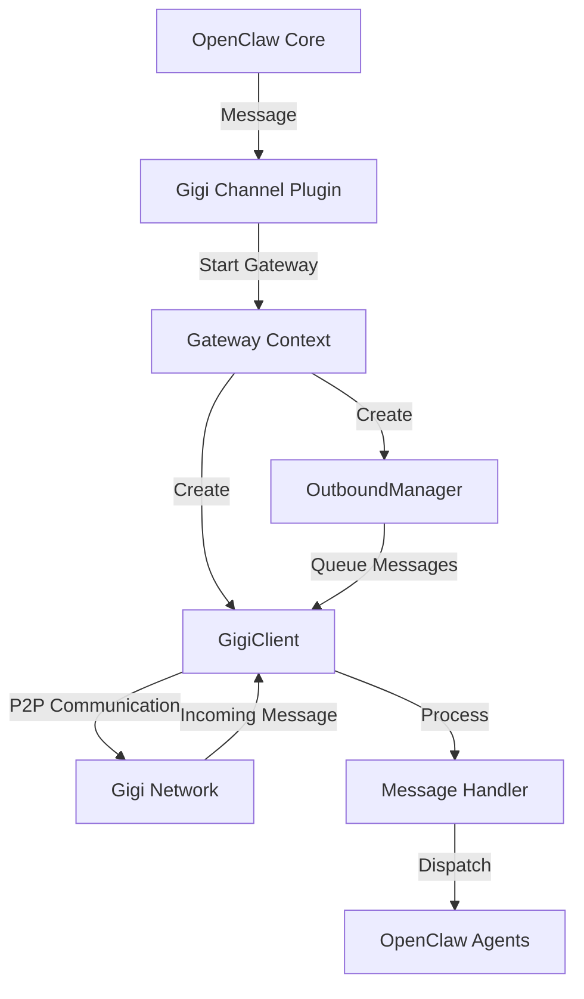

# Gigi OpenClaw Plugin Specification

## 1. Overview

The Gigi OpenClaw plugin enables P2P communication between OpenClaw agents and external peers on the Gigi P2P network. It provides a channel for sending and receiving messages, files, and agent settings queries through a decentralized P2P network.

## 2. Architecture

### 2.1 Core Components

| Component          | Description                                           | Location          |
| ------------------ | ----------------------------------------------------- | ----------------- |
| GigiClient         | Wrapper around @gigi/p2p client for P2P communication | src/GigiClient.ts |
| Channel Plugin     | OpenClaw channel implementation                       | src/channel.ts    |
| OutboundManager    | Handles outbound message queuing and retries          | src/outbound.ts   |
| Account Management | Manages Gigi account configurations                   | src/accounts.ts   |
| Types              | Type definitions for the plugin                       | src/types.ts      |

### 2.2 Gateway Architecture

The plugin uses a gateway architecture where each account has its own gateway instance:



## 3. Message Flow

### 3.1 Inbound Message Flow

1. **Message Receipt**: P2P client receives message from Gigi network
2. **Message Parsing**: Message is parsed and converted to AMP format
3. **Agent Routing**: Message is routed to appropriate OpenClaw agents
4. **Agent Processing**: Agents process the message and generate responses
5. **Response Dispatch**: Responses are sent back to the original sender

### 3.2 Outbound Message Flow

1. **Message Creation**: OpenClaw generates message to send
2. **Gateway Check**: Plugin checks if gateway is active and connected
3. **Message Formatting**: Message is formatted as AMP message
4. **Delivery**: OutboundManager handles message delivery with retries
5. **Confirmation**: Delivery status is returned to OpenClaw

## 4. Configuration

### 4.1 Account Configuration

| Configuration Option  | Type     | Description                           | Default                                         |
| --------------------- | -------- | ------------------------------------- | ----------------------------------------------- |
| mnemonic              | string   | BIP-39 mnemonic for identity          | Generated during setup                          |
| multiaddrs            | string[] | Network addresses to listen on        | ["/ip4/0.0.0.0/tcp/0", "/ip4/0.0.0.0/tcp/0/ws"] |
| displayName           | string   | Human-readable display name           | "My Gigi Node"                                  |
| nickname              | string   | Network nickname                      | Same as displayName                             |
| bootstrapPeers        | string[] | Bootstrap nodes for network discovery | []                                              |
| enableMdns            | boolean  | Enable mDNS for local discovery       | true                                            |
| enableDht             | boolean  | Enable Kademlia DHT                   | true                                            |
| enableRelay           | boolean  | Enable circuit relay                  | true                                            |
| config.allowFrom      | string[] | List of allowed peer IDs              | []                                              |
| config.dmPolicy       | string   | Direct message policy (open/pairing)  | "open"                                          |
| config.groupPolicy    | string   | Group message policy (open/allowlist) | "open"                                          |
| config.groupAllowFrom | string[] | List of allowed groups                | []                                              |
| config.agents         | object   | Agent configurations                  | {}                                              |

### 4.2 Security Configuration

| Security Option | Type     | Description                          | Default |
| --------------- | -------- | ------------------------------------ | ------- |
| dmPolicy        | string   | Direct message policy                | "open"  |
| allowFrom       | string[] | Allowed peer IDs for direct messages | []      |
| groupPolicy     | string   | Group message policy                 | "open"  |
| groupAllowFrom  | string[] | Allowed groups                       | []      |

## 5. Message Types

### 5.1 Supported Message Types

| Message Type            | Description                     | Format                    |
| ----------------------- | ------------------------------- | ------------------------- |
| Text                    | Plain text messages             | AMP TextMessage           |
| File                    | File sharing messages           | AMP FileMessage           |
| Agent Settings Query    | Query for agent information     | AMP AgentSettingsQuery    |
| Agent Settings Response | Response with agent information | AMP AgentSettingsResponse |

### 5.2 Message Structure

All messages follow the AMP (Agent Messaging Protocol) format:

```typescript
interface AmpMessage {
  type: string;
  id: string;
  timestamp: number;
  sender: {
    id: string;
    name: string;
    type: 'owner' | 'agent' | 'node';
    nodeId?: string;
  };
  target: {
    type: 'all' | 'specific' | 'node' | 'node-agent';
    agentIds?: string[];
    nodeId?: string;
  };
  // Additional type-specific fields
}
```

## 6. API

### 6.1 Channel Plugin API

| Method       | Description               | Parameters                                           | Return Type                                             |
| ------------ | ------------------------- | ---------------------------------------------------- | ------------------------------------------------------- |
| sendText     | Send text message         | ctx: { to, text, accountId, cfg, agentId }           | Promise<{ channel, messageId, chatId }>                 |
| sendMedia    | Send media message        | ctx: { to, text, mediaUrl, accountId, cfg, agentId } | Promise<{ channel, messageId, chatId }>                 |
| startAccount | Start gateway for account | ctx: { accountId, setStatus, cfg, runtime }          | Promise<void>                                           |
| listPeers    | List connected peers      | ctx: { accountId }                                   | Promise<Array<{ id, kind, name, avatar }>>              |
| listGroups   | List joined groups        | ctx: { accountId }                                   | Promise<Array<{ id, kind, name, avatar, memberCount }>> |

### 6.2 GigiClient API

| Method            | Description             | Parameters                                         | Return Type                   |
| ----------------- | ----------------------- | -------------------------------------------------- | ----------------------------- |
| start             | Start P2P client        | N/A                                                | Promise<void>                 |
| stop              | Stop P2P client         | N/A                                                | Promise<void>                 |
| sendMessage       | Send text message       | target: string, message: string                    | Promise<void>                 |
| sendFileMessage   | Send file message       | target: string, filename: string, fileSize: number | Promise<void>                 |
| sendGroupMessage  | Send group message      | groupName: string, content: string                 | Promise<void>                 |
| sendDirectMessage | Send direct message     | target: string, message: string                    | Promise<void>                 |
| joinGroup         | Join P2P group          | groupName: string                                  | Promise<void>                 |
| leaveGroup        | Leave P2P group         | groupName: string                                  | Promise<void>                 |
| shareFile         | Share file              | filePath: string                                   | Promise<string> (share code)  |
| downloadFile      | Download file           | peerId: string, shareCode: string                  | Promise<string> (download ID) |
| getPeerId         | Get current peer ID     | N/A                                                | string                        |
| getMultiaddrs     | Get network addresses   | N/A                                                | string[]                      |
| isConnected       | Check connection status | N/A                                                | boolean                       |
| listPeers         | List connected peers    | N/A                                                | any[]                         |
| listGroups        | List joined groups      | N/A                                                | any[]                         |

## 7. Integration Points

### 7.1 OpenClaw Integration

- **Channel Registration**: Plugin registers as a channel with ID "gigi-openclaw"
- **Message Routing**: Uses OpenClaw's channel.reply API for message dispatch
- **Configuration Management**: Integrates with OpenClaw's configuration system
- **Security Policies**: Implements OpenClaw's security policy model

### 7.2 Gigi Network Integration

- **P2P Client**: Uses @gigi/p2p for network communication
- **Message Protocol**: Uses @gigi/amp for message formatting
- **File Sharing**: Integrates with Gigi's file sharing capabilities
- **Group Messaging**: Supports Gigi's group messaging features

## 8. Security Considerations

### 8.1 Authentication

- Uses BIP-39 mnemonics for identity generation
- Peer IDs are derived from cryptographic keys
- All communication is encrypted via Libp2p's Noise protocol

### 8.2 Authorization

- Implements configurable DM and group policies
- Supports allowlists for both direct messages and groups
- Provides security warnings for open policies

### 8.3 Privacy

- Decentralized architecture with no central servers
- End-to-end encryption for all communications
- User-controlled data storage and sharing

## 9. Error Handling

### 9.1 Common Errors

| Error Type                  | Description                       | Handling                                |
| --------------------------- | --------------------------------- | --------------------------------------- |
| Connection Error            | P2P client fails to connect       | Retry with exponential backoff          |
| Message Delivery Failure    | Message fails to send             | Queue and retry via OutboundManager     |
| Account Configuration Error | Missing or invalid account config | Return error to OpenClaw                |
| File Sharing Error          | File share/download fails         | Fallback to text message with file path |

### 9.2 Error Reporting

- Logs errors using @gigi/logging
- Provides error status via OpenClaw's status API
- Includes error messages in gateway context

## 10. Performance Considerations

### 10.1 Scalability

- Gateway per account architecture for isolation
- Message queuing for reliable delivery
- Efficient P2P communication using Libp2p

### 10.2 Resource Usage

- Memory: Minimal per gateway instance
- CPU: Low for idle connections
- Network: Optimized for P2P communication

## 11. Future Enhancements

### 11.1 Planned Features

- End-to-end encryption for messages
- Message persistence and history
- Advanced file sharing capabilities
- Support for rich media messages
- Integration with OpenClaw's canvas features

### 11.2 Extensibility

- Plugin architecture allows for custom message handlers
- Configurable message routing logic
- Support for additional message types
- Integration with future Gigi network features

## 12. Testing

### 12.1 Test Coverage

- Unit tests for core components
- Integration tests for P2P communication
- End-to-end tests for message flow

### 12.2 Test Environment

- Local test network using bootstrap nodes
- Mock P2P clients for isolated testing
- CI/CD integration for automated testing

## 13. Deployment

### 13.1 Installation

- Included as part of OpenClaw plugin system
- Configurable via OpenClaw's channel setup wizard
- Requires no additional dependencies beyond @gigi packages

### 13.2 Configuration

- Automated setup via OpenClaw's configuration system
- Manual configuration via config files
- Environment variable support for sensitive settings

## 14. Monitoring

### 14.1 Logging

- Structured JSON logging using @gigi/logging
- Verbose mode for debugging
- Error tracking and reporting

### 14.2 Metrics

- Connection status monitoring
- Message delivery success rates
- File transfer performance
- Peer discovery metrics

## 15. Conclusion

The Gigi OpenClaw plugin provides a robust, secure, and scalable P2P communication channel for OpenClaw agents. By leveraging the Gigi P2P network, it enables direct, decentralized communication between agents and external peers without relying on centralized servers. The plugin's modular architecture and extensible design make it well-suited for future enhancements and integration with emerging P2P technologies.
