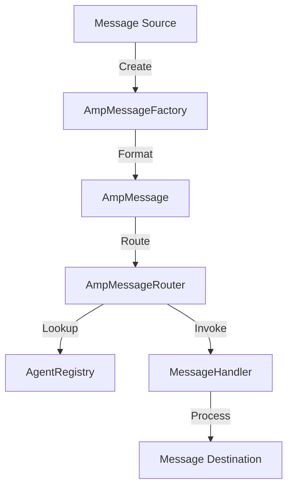

# @gigi/amp - Agent Messaging Protocol

## Overview

The Agent Messaging Protocol (AMP) is a lightweight, extensible messaging protocol designed for communication between agents, nodes, and owners in the Gigi P2P ecosystem. It provides a standardized format for messages and a flexible routing system to ensure messages reach their intended recipients.

## Architecture

### Core Components

| Component | Description | Location |
|-----------|-------------|----------|
| Message Types | Type definitions for AMP messages | src/types.ts |
| Message Router | Routes messages to appropriate handlers | src/message-router.ts |
| Agent Registry | Manages agent information and status | src/message-router.ts |
| Message Factory | Creates standardized AMP messages | src/message-router.ts |

### Message Flow



## Message Types

### Supported Message Types

| Message Type | Description | Purpose |
|--------------|-------------|---------|
| Text | Plain text messages | General communication |
| File | File sharing messages | Sharing files between peers |
| Agent Settings Query | Query for agent information | Discovering agent capabilities |
| Agent Settings Response | Response with agent information | Providing agent details |

### Message Structure

All AMP messages follow a consistent structure:

```typescript
interface AmpMessage {
  type: string;           // Message type
  id: string;             // Unique message ID
  timestamp: number;      // Unix timestamp
  sender: SenderInfo;     // Sender information
  target: MessageTarget;  // Target information
  // Additional type-specific fields
}

interface SenderInfo {
  id: string;             // Sender ID
  name: string;           // Sender name
  type: 'owner' | 'agent' | 'node'; // Sender type
  nodeId?: string;        // Optional node ID
}

interface MessageTarget {
  type: 'all' | 'specific' | 'node' | 'node-agent'; // Target type
  agentIds?: string[];    // Agent IDs for specific targets
  nodeId?: string;        // Node ID for node targets
}
```

### Type-Specific Fields

#### Text Message
```typescript
interface TextMessage extends AmpMessage {
  type: 'text';
  content: string;        // Message content
}
```

#### File Message
```typescript
interface FileMessage extends AmpMessage {
  type: 'file';
  filename: string;       // File name
  fileSize: number;       // File size in bytes
  fileHash: string;       // File hash or share code
}
```

#### Agent Settings Query
```typescript
interface AgentSettingsQuery extends AmpMessage {
  type: 'agent-settings-query';
  agentIds?: string[];    // Optional agent IDs to query
  nodeId?: string;        // Optional node ID for node-level queries
}
```

#### Agent Settings Response
```typescript
interface AgentSettingsResponse extends AmpMessage {
  type: 'agent-settings-response';
  agents: AgentInfo[];    // Agent information
}

interface AgentInfo {
  id: string;             // Agent ID
  name: string;           // Agent name
  type: string;           // Agent type
  version: string;        // Agent version
  settings: AgentSetting[]; // Agent settings
  status: 'online' | 'offline' | 'busy'; // Agent status
}

interface AgentSetting {
  id: string;             // Setting ID
  name: string;           // Setting name
  type: string;           // Setting type
  value: any;             // Setting value
  description?: string;   // Optional description
}
```

## API

### Message Factory

| Method | Description | Parameters | Return Type |
|--------|-------------|------------|-------------|
| createTextMessage | Create text message | content: string, target: MessageTarget, sender: SenderInfo | TextMessage |
| createNodeTextMessage | Create node-specific text message | content: string, nodeId: string, sender: SenderInfo | TextMessage |
| createNodeAgentTextMessage | Create node-agent text message | content: string, nodeId: string, agentId: string, sender: SenderInfo | TextMessage |
| createFileMessage | Create file message | filename: string, fileSize: number, fileHash: string, target: MessageTarget, sender: SenderInfo | FileMessage |
| createNodeFileMessage | Create node-specific file message | filename: string, fileSize: number, fileHash: string, nodeId: string, sender: SenderInfo | FileMessage |
| createNodeAgentFileMessage | Create node-agent file message | filename: string, fileSize: number, fileHash: string, nodeId: string, agentId: string, sender: SenderInfo | FileMessage |
| createAgentSettingsQuery | Create agent settings query | sender: SenderInfo, agentIds?: string[] | AgentSettingsQuery |
| createNodeAgentSettingsQuery | Create node-specific agent settings query | nodeId: string, sender: SenderInfo, agentIds?: string[] | AgentSettingsQuery |
| createAgentSettingsResponse | Create agent settings response | agents: AgentInfo[], sender: SenderInfo | AgentSettingsResponse |

### Message Router

| Method | Description | Parameters | Return Type |
|--------|-------------|------------|-------------|
| routeMessage | Route message to appropriate handler | message: AmpMessage | void |
| registerMessageHandler | Register message handler | type: string, handler: (message: AmpMessage, agentId?: string) => void | void |
| unregisterMessageHandler | Unregister message handler | type: string | void |
| registerAgent | Register agent with registry | agent: AgentInfo | void |
| unregisterAgent | Unregister agent from registry | agentId: string | void |

### Agent Registry

| Method | Description | Parameters | Return Type |
|--------|-------------|------------|-------------|
| getAgentById | Get agent by ID | id: string | AgentInfo  undefined |
| getAllAgents | Get all agents | N/A | AgentInfo[] |
| updateAgentStatus | Update agent status | id: string, status: 'online'  'offline'  'busy' | void |
| registerAgent | Register new agent | agent: AgentInfo | void |
| unregisterAgent | Unregister agent | agentId: string | void |

## Routing Logic

The message router uses the following logic to route messages:

1. **Text Messages**:
   - `target.type === 'all'`: Route to all online agents
   - `target.type === 'specific'`: Route to specified online agents
   - `target.type === 'node'`: Route to node handler
   - `target.type === 'node-agent'`: Route to specific agent on specific node

2. **File Messages**:
   - Same routing logic as text messages

3. **Agent Settings Queries**:
   - `nodeId` present: Route to node handler
   - No `nodeId`: Generate response from local agent registry

4. **Agent Settings Responses**:
   - Route to original requester

## Integration

### With Gigi P2P

AMP is integrated with the Gigi P2P client to handle messaging between peers:

```typescript
// Example integration with GigiClient
const client = new GigiClient({
  multiaddrs: ['/ip4/0.0.0.0/tcp/0'],
  displayName: 'My Node',
  mnemonic: '...',
});

// Handle incoming messages
client.onMessage((message) => {
  messageRouter.routeMessage(message);
});

// Send message
const textMessage = AmpMessageFactory.createTextMessage(
  'Hello world',
  { type: 'specific', agentIds: ['agent1'] },
  { id: client.getPeerId(), name: 'My Node', type: 'node' }
);

await client.sendMessage('peer1', JSON.stringify(textMessage));
```

### With OpenClaw

AMP is used by the Gigi OpenClaw plugin to handle communication between OpenClaw agents and external peers:

```typescript
// Example integration with OpenClaw
const ampMessage = AmpMessageFactory.createTextMessage(
  content,
  target,
  {
    id: senderId,
    name: senderName,
    type: 'agent',
  }
);

await gateway.outbound.sendMessage(to, JSON.stringify(ampMessage));
```

## Security Considerations

- **Message Integrity**: Messages include unique IDs and timestamps to prevent replay attacks
- **Sender Authentication**: Messages include sender information that can be verified
- **Targeting**: Granular targeting allows for precise message delivery
- **Encryption**: Messages can be encrypted at the transport layer (via Libp2p)

## Performance Considerations

- **Lightweight Format**: JSON-based format for easy parsing and serialization
- **Efficient Routing**: Direct routing to intended recipients reduces network overhead
- **Scalable**: Supports routing to multiple agents and nodes

## Extensibility

- **Custom Message Types**: New message types can be added by extending the MessageType union
- **Custom Handlers**: Applications can register custom handlers for specific message types
- **Custom Agent Registries**: Applications can implement custom agent registries for specialized use cases

## Testing

AMP includes comprehensive unit tests for core functionality:

- Message router tests
- Message factory tests
- Agent registry tests

## Future Enhancements

- **Schema Validation**: Add JSON schema validation for messages
- **Message Acknowledgment**: Add delivery confirmation mechanism
- **Message Prioritization**: Add priority levels for messages
- **Rich Media Support**: Add support for rich media messages
- **Message History**: Add message persistence and history

## Conclusion

The Agent Messaging Protocol (AMP) provides a robust, flexible foundation for communication in the Gigi P2P ecosystem. Its standardized message format and powerful routing system enable seamless communication between agents, nodes, and owners across the decentralized network. With its extensible design, AMP can adapt to future requirements and use cases as the ecosystem evolves.
